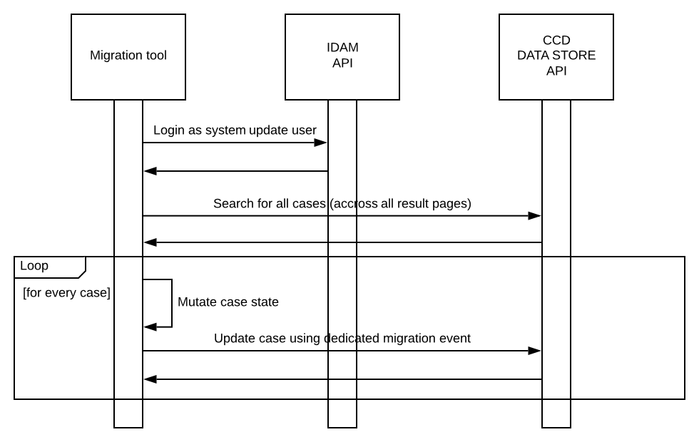

# Civil CCD Data Migration Tool

## Basic overview

It works by accessing the ccd-data-store-api as the system user, grabbing and filtering all cases, and then migrating the filtered cases.
To perform the migration there needs to be an event defined in the consuming case type that is defined with the ID `migrateCase`, this needs to be defined in CCD Definition.

This event `migrateCase` is then triggered by the `CaseMigrationProcessor`and as it is a CCD event it can have the standard CCD hooks,
i.e. `about-to-start`, `about-to-submit`, `submitted`.
Civil makes use of the `about-to-submit` hook to then perform the main part of migration.

### Features
- Ability to migrate single case by providing the CCD case Id i.e. `migration.caseIds=1234`
- Ability to migrate list of cases by providing comma separated list of case Ids i.e. `migration.caseIds=1234,56789`
- Ability to `dryRun` which should not invoke the update case, but still give us the count that will be migrated with actual run
- Ability to stop when reached to maximum no of cases to process. this can can be configured before each run using `migration.maxCasesToProcess`
- Performance improvements to fetch cases page by page bases and then process/migrate cases in parallel. Have ability to configure the number of threads `numThreads`
- Performance improvements to use elastic search while fetching the cases.
- Ability to turn on/off elastic search as we do't have ES for all of our lower environments. i.e. `migration.esEnabled=true`
- Further more ability to configure the query size for ES. i.e. `migration.esQuerySize=500`
- We can configure what event we need to fire, by default it uses `migrateCase` CCD event.
### Configuration properties
```yaml
migration:
  caseIds: ${MIGRATION_CASE_IDS:}
  caseType: ${MIGRATION_CASE_TYPE}
  eventId: ${MIGRATION_CASE_EVENT_ID:migrateCase}
  eventDescription: ${MIGRATION_CASE_EVENT_DESC:Migrate Case}
  eventSummary: ${MIGRATION_CASE_EVENT_SUMMARY:Migrate Case}
  dryRun: ${MIGRATION_DRY_RUN:false}
  maxCasesToProcess: ${MIGRATION_CASE_LIMIT:50000}
  numThreads: ${MIGRATION_NO_OF_THREADS:20}
  esEnabled: ${MIGRATION_ES_ENABLED:false}
  esQuerySize: ${MIGRATION_ES_QUERY_SIZE:500}
```
### Processor framework

The migration framework for data migrations within CCD that runs the following process:



## Build

To build the project run

```shell
./gradlew clean build
```

this will generate a jar in the `build/libs` directory which can then be used when running the migration.

## Running

To run the jar you will need to do the following

```shell
java -jar \
-Dspring.application.name="civil-ccd-case-migration-tool" \
-Didam.api.url="https://idam-api.aat.platform.hmcts.net" \
-Didam.client.id="[CLIENT ID]" \
-Didam.client.secret="[VALUE IN VAULT]" \
-Didam.client.redirect_uri="https://civil-service-aat.service.core-compute-aat.internal/oauth2/callback" \
-Dcore_case_data.api.url="http://ccd-data-store-api-aat.service.core-compute-aat.internal" \
-Didam.s2s-auth.url="http://rpe-service-auth-provider-aat.service.core-compute-aat.internal" \
-Didam.s2s-auth.microservice="civil-service" \
-Didam.s2s-auth.totp_secret="[VALUE IN VAULT]" \
-Didam.username="cmc-system-update@mailnesia.com" \
-Didam.password="[VALUE IN VAULT]" \
-Dmigration.jurisdiction="Civil" \
-Dmigration.caseType="[CASE TYPE]" \
-Dmigration.esEnabled="[true/false]" \
-Dmigration.dryRun="[true/false]" \
-Dlogging.level.root="ERROR" \
-Dlogging.level.uk.gov.hmcts.reform="INFO" \
PATH/TO/MIGRATION.jar
```

where

- `idam.client.secret`
- `idam.s2s-auth.totp_secret`
- `migration.idam.password`

can all be found in the relevant vault.

Note that the parameters given are using AAT environment as an example.

NOTE: `migration.esEnabled` can be set to false for the environments where we don't have elastic search available. i.e. `local` or `preview`.
## License

This project is licensed under the MIT License - see the [LICENSE](LICENSE) file for details.

